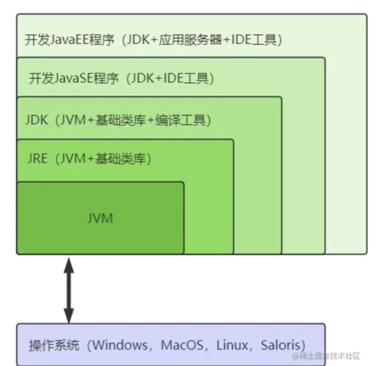
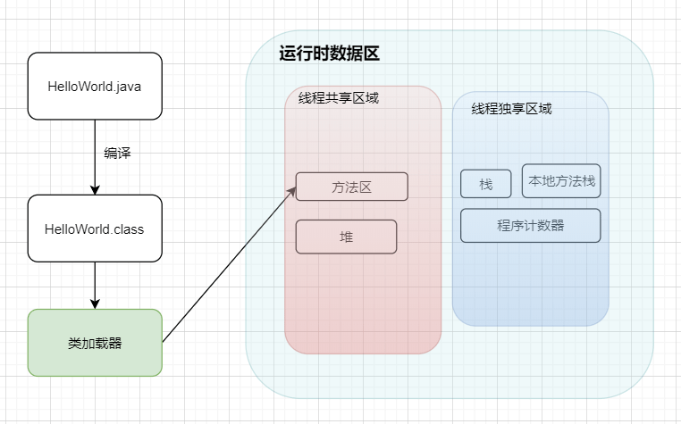
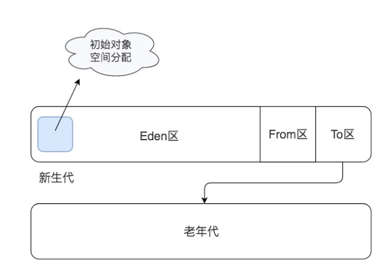

# JVM (Java Virtual Machine Java虚拟机)

Java虚拟机，是Java程序的运行环境（Java二进制字节码.class的运行环境）。
VM 本质上也是一个应用程序，启动以后加载执行 Java 字节码文件。

## JVM JRE JDK

JRE: Java Runtime Environment（Java运行时环境）
JDK：Java Development Kit（Java开发工具包）
JavaSE：Java Standard Edition（Java标准版）
JavaEE：Java Enterprise Edition（Java企业版）

## java 文件运行过程

### JVM GC

JVM 将堆空间分成新生代（young）和老年代（old）两个区域，创建对象的时候，只在新生代创建，当新生代空间不足的时候，只对新生代进行垃圾回收，这样需要处理的内存空间就比较小，垃圾回收速度就比较快。

年轻代又会分为Eden和Survivor区。Survivor 也会分为FromPlace和ToPlace，toPlace 的 survivor 区域是空的,每次垃圾回收都是扫描 Eden 区和 From 区，将存活对象复制到 To 区，然后交换 From 区和 To 区的名称引用，下次垃圾回收的时候继续将存活对象从 From 区复制到 To 区。
当一个对象经过几次新生代垃圾回收，也就是几次从 From 区复制到 To 区以后，依然存活，那么这个对象就会被复制到老年代区域。

当老年代空间已满，也就是无法将新生代中多次复制后依然存活的对象复制进去的时候，就会对新生代和老年代的内存空间进行一次全量垃圾回收，即 Full GC。
所以根据应用程序的对象存活时间，合理设置老年代和新生代的空间比例对 JVM 垃圾回收的性能有很大影响，JVM 设置老年代新生代比例的参数是 -XX:NewRatio。

垃圾回收器有四种

第一种是 Serial 串行垃圾回收器，这是 JVM 早期的垃圾回收器，只有一个线程执行垃圾回收。

第二种是 Parallel 并行垃圾回收器，它启动多线程执行垃圾回收。
如果 JVM 运行在多核 CPU 上，那么显然并行垃圾回收要比串行垃圾回收效率高。在串行和并行垃圾回收过程中，当垃圾回收线程工作的时候，必须要停止用户线程的工作，
否则可能会导致对象的引用标记错乱，因此垃圾回收过程也被称为 stop the world，在用户视角看来，所有的程序都不再执行，整个世界都停止了。

第三种 CMS 并发垃圾回收器，在垃圾回收的某些阶段，垃圾回收线程和用户线程可以并发运行，因此对用户线程的影响较小。Web 应用这类对用户响应时间比较敏感的场景，适用 CMS 垃圾回收器。

最后一种是 G1 垃圾回收器，它将整个堆空间分成多个子区域，然后在这些子区域上各自独立进行垃圾回收，在回收过程中垃圾回收线程和用户线程也是并发运行。
G1 综合了以前几种垃圾回收器的优势，适用于各种场景，是未来主要的垃圾回收器。

到 jdk8 为止，默认的垃圾收集器是 Parallel Scavenge 和 Parallel Old从 jdk9 开始，G1 收集器成为默认的垃圾收集器 目前来看，G1 回收器停顿时间最短而且没有明显缺点，非常适合 Web 应用。

在 jdk8 中测试 Web 应用，堆内存 6G，新生代 4.5G 的情况下，Parallel Scavenge 回收新生代停顿长达 1.5 秒。G1 回收器回收同样大小的新生代只停顿 0.2 秒

### 帮助记忆（非标准）

开头的选项-X是非标准的（不保证在所有 VM 实现上都受支持），并且在 JDK 的后续版本中可能会发生更改，恕不另行通知。
指定的选项-XX不稳定，如有更改，恕不另行通知。

助记的话：
- Xmx:  memory maximum  最大堆大小
- Xms： memory startup 初始堆大小
- Xmn: memory nursery/new 年轻代大小
- Xss: stack size 每个线程的堆栈大小

## 参考
- [大白话带你认识 JVM](https://javaguide.cn/java/jvm/jvm-intro.html)
- [后端技术面试 38 讲 03丨Java虚拟机原理：JVM为什么被称为机器（machine）？](https://time.geekbang.org/column/article/168945)