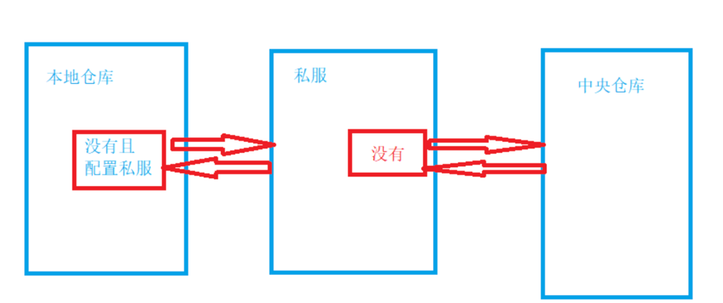

<!-- START doctoc generated TOC please keep comment here to allow auto update -->
<!-- DON'T EDIT THIS SECTION, INSTEAD RE-RUN doctoc TO UPDATE -->
**Table of Contents**  *generated with [DocToc](https://github.com/thlorenz/doctoc)*

- [maven](#maven)
  - [配置](#%E9%85%8D%E7%BD%AE)
    - [setting.xml](#settingxml)
      - [Servers](#servers)
      - [Mirrors](#mirrors)
      - [Profiles](#profiles)
    - [pom.xml](#pomxml)
      - [项目的基本信息](#%E9%A1%B9%E7%9B%AE%E7%9A%84%E5%9F%BA%E6%9C%AC%E4%BF%A1%E6%81%AF)
      - [modules](#modules)
      - [scm(Software Configuration Management 软件配置管理)](#scmsoftware-configuration-management-%E8%BD%AF%E4%BB%B6%E9%85%8D%E7%BD%AE%E7%AE%A1%E7%90%86)
      - [properties](#properties)
      - [项目的依赖列表](#%E9%A1%B9%E7%9B%AE%E7%9A%84%E4%BE%9D%E8%B5%96%E5%88%97%E8%A1%A8)
      - [项目的构建配置](#%E9%A1%B9%E7%9B%AE%E7%9A%84%E6%9E%84%E5%BB%BA%E9%85%8D%E7%BD%AE)
        - [build](#build)
        - [plugins](#plugins)
  - [Maven项目结构](#maven%E9%A1%B9%E7%9B%AE%E7%BB%93%E6%9E%84)
  - [mvn 命令](#mvn-%E5%91%BD%E4%BB%A4)
  - [参考](#%E5%8F%82%E8%80%83)

<!-- END doctoc generated TOC please keep comment here to allow auto update -->

# maven 
Maven是一个项目管理工具，它包含了一个对象模型。一组标准集合，一个依赖管理系统。和用来运行定义在生命周期阶段中插件目标和逻辑。


Maven的核心功能是合理叙述项目间的依赖关系，通俗点 就是通过pom.xml文件的配置获取jar包不用手动的去添加jar包


## 依赖关系
Maven定义了几种依赖关系，分别是compile、test、runtime和provided.

## 配置


settings.xml 中包含类似本地仓储位置、修改远程仓储服务器、认证信息等配置。

- settings.xml 是 maven 的全局配置文件。

- pom.xml 文件是本地项目配置文件。


pom.xml > user settings > global settings


仓库就是存放jar包的地方，即我们前面说的通过pom.xml中通过设置索引来到仓库中寻找jar包
仓库分为：本地仓库，第三方仓库，中央仓库。



获取jar包的过程:
优先从本地仓库查找，如果本地仓库没有该jar包，如果配置了私服，就从私服中查找，私服中没有就从中央仓库中查找，然后下载到本地仓库，下次使用就可以直接从本地仓库中查找，没有配置私服则，直接从中央仓库中查找


### setting.xml
```shell
✗ cat ~/.m2/settings.xml 
<?xml version="1.0" encoding="UTF-8"?>

<settings xmlns="http://maven.apache.org/SETTINGS/1.0.0"
          xmlns:xsi="http://www.w3.org/2001/XMLSchema-instance"
          xsi:schemaLocation="http://maven.apache.org/SETTINGS/1.0.0 http://maven.apache.org/xsd/settings-1.0.0.xsd">
  <pluginGroups>
  </pluginGroups>
  <proxies>
  </proxies>
  <servers>
    <server>
    </server>
  </servers>
  <mirrors>
    <mirror>
      <id>aliyunmaven</id>
      <mirrorOf>central</mirrorOf>
      <name>aliyunmaven</name>
      <url>https://maven.aliyun.com/repository/public</url>
    </mirror>
  </mirrors>
  <profiles>
  </profiles>
</settings>

```
#### Servers
一般，仓库的下载和部署是在 pom.xml 文件中的 repositories 和 distributionManagement 元素中定义的。
然而，一般类似用户名、密码（有些仓库访问是需要安全认证的）等信息不应该在 pom.xml 文件中配置，这些信息可以配置在 settings.xml 中。


#### Mirrors
作用：为仓库列表配置的下载镜像列表.
中国区用户可以使用阿里云提供的Maven镜像仓库。


#### Profiles
作用：根据环境参数来调整构建配置的列表。

settings.xml 中的 profile 元素是 pom.xml 中 profile 元素的裁剪版本


### pom.xml
是 项目对象模型 - Project Object Model（POM）的缩写.

POM定义了项目的所有属性，包括项目的名称、版本、依赖关系、构建配置等。使用pom.xml，我们可以轻松地管理项目的构建和依赖关系，让我们能够更专注于业务逻辑的开发.

主要用法其实有三种：

- 添加依赖：在dependencies标签下添加依赖，包括groupId、artifactId、version、scope等信息。
- 修改打包方式：在packaging标签下修改项目的打包方式，通常是jar、war或pom。
- 配置插件：在build标签下配置插件，包括groupId、artifactId、version等信息。插件可以帮助我们处理各种构建任务，比如编译代码、生成文档、打包文件等。

```xml
<!--https://github.com/apache/zookeeper/blob/c26634f34490bb0ea7a09cc51e05ede3b4e320ee/pom.xml-->

<?xml version="1.0" encoding="UTF-8"?>
<project xmlns="http://maven.apache.org/POM/4.0.0" xmlns:xsi="http://www.w3.org/2001/XMLSchema-instance" xsi:schemaLocation="http://maven.apache.org/POM/4.0.0 http://maven.apache.org/maven-v4_0_0.xsd">

  <modelVersion>4.0.0</modelVersion>
  <parent>
    <groupId>org.apache</groupId>
    <artifactId>apache</artifactId>
    <version>23</version>
    <relativePath />
    <!-- no parent resolution -->
  </parent>
  <groupId>org.apache.zookeeper</groupId>
  <artifactId>parent</artifactId>
  <packaging>pom</packaging>
  <!-- to change version: mvn -B release:update-versions -DdevelopmentVersion=3.6.0-SNAPSHOT -->
  <version>3.9.3</version>
  <name>Apache ZooKeeper</name>
  <description>
    ZooKeeper is a centralized service for maintaining configuration information, naming,
    providing distributed synchronization, and providing group services. All of these kinds
    of services are used in some form or another by distributed applications. Each time they
    are implemented there is a lot of work that goes into fixing the bugs and race conditions
    that are inevitable. Because of the difficulty of implementing these kinds of services,
    applications initially usually skimp on them ,which make them brittle in the presence of
    change and difficult to manage. Even when done correctly, different implementations of
    these services lead to management complexity when the applications are deployed.
  </description>
  <url>http://zookeeper.apache.org</url>
  <inceptionYear>2008</inceptionYear>
  <!-- Set here so we can consistently use the correct name, even on branches with
       an ASF parent pom older than v15. Also uses the url from v18.
    -->
  <licenses>
    <license>
      <name>Apache License, Version 2.0</name>
      <url>https://www.apache.org/licenses/LICENSE-2.0.txt</url>
      <distribution>repo</distribution>
    </license>
  </licenses>

  <modules>
    <module>zookeeper-docs</module>
    <module>zookeeper-jute</module>
  </modules>

  <scm>
    <connection>scm:git:https://gitbox.apache.org/repos/asf/zookeeper.git</connection>
    <developerConnection>scm:git:https://gitbox.apache.org/repos/asf/zookeeper.git</developerConnection>
    <url>https://gitbox.apache.org/repos/asf/zookeeper.git</url>
    <tag>release-3.9.3-2</tag>
  </scm>
  <issueManagement>
    <system>JIRA</system>
    <url>http://issues.apache.org/jira/browse/ZOOKEEPER</url>
  </issueManagement>
  <ciManagement>
    <system>jenkins</system>
    <url>https://ci-hadoop.apache.org/view/ZooKeeper/</url>
  </ciManagement>
  <mailingLists>
  </mailingLists>
  <developers>

  </developers>

  <profiles>
    <profile>
      <id>full-build</id>
      <modules>
        <module>zookeeper-contrib</module>
        <!-- zookeeper-it needed by fatjar contrib -->
        <module>zookeeper-it</module>
      </modules>
    </profile>
    <profile>
      <!-- fatjar only profile; zookeeper-contrib will activate the fatjar in its pom -->
      <id>fatjar</id>
      <modules>
        <module>zookeeper-contrib</module>
        <!-- zookeeper-it needed by fatjar contrib -->
        <module>zookeeper-it</module>
      </modules>
    </profile>
    <profile>
        <id>apache-release</id>
        <build>
            <plugins>
                <plugin>
                    <groupId>org.apache.maven.plugins</groupId>
                    <artifactId>maven-assembly-plugin</artifactId>
                    <dependencies>
                        <dependency>
                            <groupId>org.apache.apache.resources</groupId>
                            <artifactId>apache-source-release-assembly-descriptor</artifactId>
                            <version>1.0.6</version>
                        </dependency>
                    </dependencies>
                    <executions>
                        <execution>
                            <id>source-release-assembly-tar-gz</id>
                            <phase>initialize</phase>
                            <goals>
                                <goal>single</goal>
                            </goals>
                            <configuration>
                                <runOnlyAtExecutionRoot>true</runOnlyAtExecutionRoot>
                                <descriptorRefs>
                                    <!-- defined in Apache Parent Pom -->
                                    <descriptorRef>${sourceReleaseAssemblyDescriptor}</descriptorRef>
                                </descriptorRefs>
                                <finalName>apache-zookeeper-${project.version}</finalName>
                                <appendAssemblyId>false</appendAssemblyId>
                                <formats>
                                    <format>tar.gz</format>
                                </formats>
                                <tarLongFileMode>posix</tarLongFileMode>
                            </configuration>
                        </execution>
                    </executions>
                </plugin>
            </plugins>
        </build>
    </profile>
    <profile>
      <id>m2e</id>
      <activation>
        <property>
          <name>m2e.version</name>
        </property>
      </activation>
      <properties>
        <maven.compiler.release>8</maven.compiler.release>
      </properties>
      <build>
        <pluginManagement>
          <plugins>
              
          </plugins>
        </pluginManagement>
      </build>
    </profile>
    <profile>
      <id>jdk-release-flag</id>
      <activation>
        <jdk>[9,)</jdk>
      </activation>
      <properties>
        <maven.compiler.release>8</maven.compiler.release>
      </properties>
    </profile>
    <profile>
      <id>clover</id>
      <activation>
        <activeByDefault>false</activeByDefault>
        <property>
          <name>clover</name>
        </property>
      </activation>
      <properties>
        <cloverDatabase>${project.build.directory}/clover/zookeeper-coverage.db</cloverDatabase>
      </properties>
      <build>
        <plugins>
        </plugins>
      </build>
    </profile>
    <profile>
      <id>sonar</id>
      <properties>
        <sonar.php.coverage.reportPaths>${project.build.directory}/clover/clover.xml</sonar.php.coverage.reportPaths>
      </properties>
      <build>
        <plugins>
          <plugin>
            <groupId>org.sonarsource.scanner.maven</groupId>
            <artifactId>sonar-maven-plugin</artifactId>
          </plugin>
        </plugins>
        <pluginManagement>
          <plugins>
            <plugin>
              <groupId>org.sonarsource.scanner.maven</groupId>
              <artifactId>sonar-maven-plugin</artifactId>
              <version>${sonar-maven-plugin.version}</version>
              <configuration>
                <sonar.dynamicAnalysis>reuseReports</sonar.dynamicAnalysis>
                <sonar.core.codeCoveragePlugin>clover</sonar.core.codeCoveragePlugin>
                <sonar.clover.reportPath>${project.build.directory}/clover/clover.xml</sonar.clover.reportPath>
                <sonar.surefire.reportsPath>target/surefire-reports</sonar.surefire.reportsPath>
                <sonar.core.codeCoveragePlugin>clover</sonar.core.codeCoveragePlugin>
                <sonar.clover.version>${clover-maven-plugin.version}</sonar.clover.version>
              </configuration>
            </plugin>
          </plugins>
        </pluginManagement>
      </build>
    </profile>
  </profiles>

  <properties>
    <!-- maven properties -->
    <maven.compiler.source>1.8</maven.compiler.source>
    <maven.compiler.target>1.8</maven.compiler.target>
    <project.build.outputTimestamp>1729206981</project.build.outputTimestamp>
    <dependency.locations.enabled>false</dependency.locations.enabled>
    <surefire.version>2.22.1</surefire.version>

    <surefire-forkcount>8</surefire-forkcount>
    <redirectTestOutputToFile>true</redirectTestOutputToFile>

    <!-- dependency versions -->
    <slf4j.version>1.7.30</slf4j.version>
    <logback-version>1.2.13</logback-version>
    <audience-annotations.version>0.12.0</audience-annotations.version>
    <jmockit.version>1.48</jmockit.version>
    <junit.version>5.6.2</junit.version>

    <!-- parameters to pass to C client build -->
    <c-client-openssl>yes</c-client-openssl>
    <c-client-sasl>yes</c-client-sasl>

  </properties>

  <dependencyManagement>
    <dependencies>

    </dependencies>
  </dependencyManagement>

  <build>
    <pluginManagement>
      <plugins>
    
      </plugins>
    </pluginManagement>

    <plugins>
    
    </plugins>
    <resources>
      <resource>
        <directory>${project.basedir}src/main/java/resources</directory>
        <excludes>
          <exclude>**/*.*</exclude>
        </excludes>
      </resource>
    </resources>
  </build>

  <reporting>
    <plugins>
      <plugin>
        <groupId>org.openclover</groupId>
        <artifactId>clover-maven-plugin</artifactId>
      </plugin>
    </plugins>
  </reporting>

</project>

```


#### 项目的基本信息
与项目的基本信息相关的标签有很多，以下算必填项:

groupId：项目的组名，通常是反转的域名，比如com.example。

artifactId：项目的唯一标识符，通常是项目的名称。

version：项目的版本号。

packaging：项目的打包方式，通常是jar、war或pom，如果没有指定packaging，默认值是jar。


#### modules
modules 标签用于声明当前 Maven 项目包含的模块子项目，每个子项目都是一个独立的 Maven 项目，具有自己的 pom.xml 文件，可以进行独立构建和测试。在父项目的 pom.xml 文件中，使用 标签来列出所有子项目的名称，


#### scm(Software Configuration Management 软件配置管理)
Maven中用于指定源代码版本控制信息的标签。它可以帮助Maven获取源代码并将构建生成的二进制文件提交到版本控制系统中。scm标签通常用于指定源代码管理系统的类型、URL、开发者连接等详细信息。

#### properties
properties 严格来说，并不一定是项目本身的信息，而是人为设置的属性或者说宏，这个标签用来定义和管理项目中所需要的属性，
- 统一管理项目中的常用属性，比如版本号、路径、插件版本等，方便统一修改和管理。
- 可以在配置过程中使用 ${…}占位符引用这些属性，使得配置更加灵活和便捷。
- 避免硬编码，提高代码的可维护性和可读性


#### 项目的依赖列表


#### 项目的构建配置

##### build
用于定义项目的构建配置，包括源代码目录、资源目录、插件等.
在一个标准的Maven项目中，sourceDirectory默认值应该是src/main/java。如果有自定义的代码目录结构，需要显式地设置sourceDirectory元素的值。
```shell
|--src
   |--main
      |--java  // Java主源代码目录
      |--resources // 资源文件目录
   |--test
      |--java // 测试主代码目录
      |--resources // 测试资源文件目录

```

##### plugins

定义 Maven 插件， plugins 主要用于扩展 Maven 的功能，帮助开发人员更方便地构建、打包、发布项目。插件可以通过 Maven 的插件中心或者自己构建的私有仓库来使用，能在构建过程中执行特定的任务，比如编译、打包、测试等。

* maven-jar-plugin 用于将项目打包为JAR文件
* maven-release-plugin 可以帮助我们在代码库中创建一个稳定的发布版本，并将其发布到Maven仓库中，同时更新开发版本号，以便于下次开发版本的迭代


## Maven项目结构

一个使用Maven管理的普通的Java项目，它的目录结构默认如下：

```shell
a-maven-project
├── pom.xml
├── src
│   ├── main
│   │   ├── java
│   │   └── resources
│   └── test
│       ├── java
│       └── resources
└── target
```


src目录存放Java源码，resources目录存放配置文件，bin目录存放编译生成的.class文件。

项目的根目录a-maven-project是项目名，它有一个项目描述文件pom.xml，存放Java源码的目录是src/main/java，存放资源文件的目录是src/main/resources，
存放测试源码的目录是src/test/java，存放测试资源的目录是src/test/resources，
最后，所有编译、打包生成的文件都放在target目录里。这些就是一个Maven项目的标准目录结构


## mvn 命令

```shell
$ mvn -version                                                       
WARNING: A restricted method in java.lang.System has been called
WARNING: java.lang.System::load has been called by org.fusesource.jansi.internal.JansiLoader in an unnamed module (file:/Users/python/.sdkman/candidates/maven/current/lib/jansi-2.4.1.jar)
WARNING: Use --enable-native-access=ALL-UNNAMED to avoid a warning for callers in this module
WARNING: Restricted methods will be blocked in a future release unless native access is enabled

Apache Maven 3.9.9 (8e8579a9e76f7d015ee5ec7bfcdc97d260186937)
Maven home: /Users/python/.sdkman/candidates/maven/current
Java version: 24.0.1, vendor: Azul Systems, Inc., runtime: /Users/python/.sdkman/candidates/java/24.0.1-zulu/zulu-24.jdk/Contents/Home
Default locale: zh_CN_#Hans, platform encoding: UTF-8
OS name: "mac os x", version: "26.0.1", arch: "aarch64", family: "mac"

$ mvn --help         

usage: mvn [options] [<goal(s)>] [<phase(s)>]

```

Maven的生命周期由一系列阶段（phase）构成，以内置的生命周期default为例，它包含以下phase：

* validate
* initialize
* generate-sources
* process-sources
* generate-resources
* process-resources
* compile
* process-classes
* generate-test-sources
* process-test-sources
* generate-test-resources
* process-test-resources
* test-compile
* process-test-classes
* test
* prepare-package
* package
* pre-integration-test
* integration-test
* post-integration-test
* verify
* install
* deploy 

mvn package，Maven就会执行default生命周期，它会从开始一直运行到package这个phase为止

mvn这个命令时，后面的参数是phase，Maven自动根据生命周期运行到指定的phase。

在实际开发过程中，经常使用的命令有：

mvn clean：清理所有生成的class和jar；

mvn clean compile：先清理，再执行到compile；

mvn clean test：先清理，再执行到test，因为执行test前必须执行compile，所以这里不必指定compile；

mvn clean package：先清理，再执行到package


执行一个phase又会触发一个或多个goal.goal的命名总是abc:xyz这种形式。

## 参考
- https://github.com/apache/maven
- [Maven 教程之 settings.xml 详解](https://cloud.tencent.com/developer/article/1522574)
- [Java-Maven详解](https://www.cnblogs.com/liugp/p/16221170.html)
- [全面详解Maven的配置文件pom.xml](https://blog.csdn.net/qq_20236937/article/details/135893883)