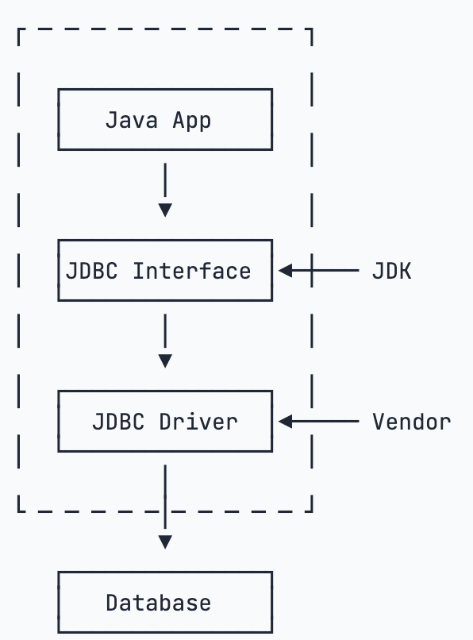

# jdbc(Java DataBase Connectivity Java程序访问数据库的标准接口)

使用Java程序访问数据库时，Java代码并不是直接通过TCP连接去访问数据库，而是通过JDBC接口来访问，而JDBC接口则通过JDBC驱动来实现真正对数据库的访问.

实际上，一个MySQL的JDBC的驱动就是一个jar包，它本身也是纯Java编写的。我们自己编写的代码只需要引用Java标准库提供的java.sql包下面的相关接口，由此再间接地通过MySQL驱动的jar包通过网络访问MySQL服务器，
所有复杂的网络通讯都被封装到JDBC驱动中，因此，Java程序本身只需要引入一个MySQL驱动的jar包就可以正常访问MySQL服务器

## 参考

